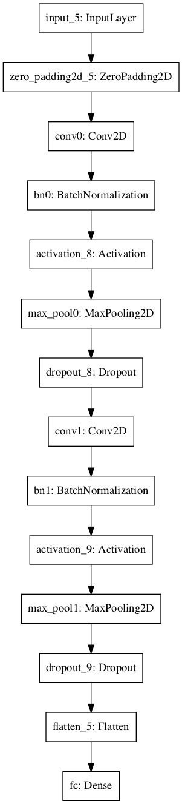

# geoimages
Package developed for machine learning proofs of concept for a geotechnical imaging firm.

## Use and Development
### Create Conda environment:
> $ conda env create -f environment.yml 

### For active development:  
> $ conda activate geoimages  
> $ pip install -e . --no-deps

## Summary  
***Machine Learning Accelerates Identification of Priority Geological Images***  
    
***Need:*** A geotechnical consulting company needed a process to aid and speed identification of various igneous, metamorphic, and sedimentary rocks, and interesting features and patterns in their collection of geotechnical imagery data.

***Approach:***  
* Supervised machine learning to classify images as either Andesite, Gneiss, Marble, Quartzite, Rhyolite, or Schist.
* Unsupervised machine learning to identify images similar to a candidate image that contained an interesting feature or pattern.

***Requirements:*** 
* With greater than 90 percent accuracy, classify a candidate into 1 of 6 categories.
* Identify target images that have similar characteristics to the single candidate image.
* Score target images such that targets are most similar to the candidate image.
* Return n-target images based on defined input.

***Image Classification:***    
A convolutional network was developed using approximately 21,000 training images to rapidly classify a geotechnical image as either Andesite, Gneiss, Marble, Quartzite, Rhyolite, or Schist.  Three architectures were evaluated, 1-layer convolutional network, 2-layer convolutional network, and a modified VGGNet.  The 2-layer network achieved accuracy greater than 95 percent on a test set of approximately 3,500 images.    

***Image Similarity:***  
Two models were developed to aid and speed identification of distinguishing features and patterns in a set of geological imagery. Using an unsupervised machine learning approach and, separately, a vector-distance/ similarity approach, the models successfully identified target images such that targets were most similar to a single input candidate image. Both models yielded similar results, with some overlap in the returned target-image sets. Both the K-Means unsupervised machine learning approach and the vector-distance/ similarity approach had similar elapsed times for prediction. Fitting each model took less than a minute, with a training-set of approximately one-hundred thousand images. However, elapsed time for training the K-Means model was significantly higher than the vector-distance/ similarity approach and may present limitations as the training data scales. A/B testing was recommended to determine which model returns more valuable results.

***Methodology:***
> Supervised Machine Learning Process     
> [Extract, Transform, Load](https://github.com/neumj/geo-images/blob/master/notebooks/etl_image_classification.ipynb)  
> * Unzip geotechnical_images.zip in images directory using Images Class unzip_images() method.
> * Randomly sample images for training, development, and testing purposes using Images Class sample_images() method.
> * Generate image metadata for training, development, and testing images using Images Class generate_image_metadata() method.
> * Convert images and labels for model training, development, and testing using Images Class images_to_x_y() method.
> * Save X, Y data as *.h5* file.
>
> [Train and Evaluate Image Classification Models](https://github.com/neumj/geo-images/blob/master/notebooks/train_image_classification.ipynb)
> * Load training, development, and testing data.
> * Normalize X_Train, X_Dev, X_Test.
> * Convert Y data to one-hot encoding using Labels Class method categorical_to_onehot() method.
> * Optimize hyperparameters for 1-Layer, 2-Layer, and smallVGGNet models.
> * Evaluate 1-Layer, 2-Layer, and smallVGGNet models on test set.
> * Save best performing model.
>
> [Image Classification, Predict](https://github.com/neumj/geo-images/blob/master/notebooks/predict_image_classification.ipynb)
> * Load 2-layer model.
> * Load candidate image.
> * Predict classification.

> Unsupervised Machine Learning Process     
> [Extract, Transform, Load](https://github.com/neumj/geo-images/blob/master/notebooks/etl_image_similarity.ipynb)  
> * Unzip geotechnical_images.zip in images directory using Images Class unzip_images() method.
> * Randomly sample images for development and testing purposes using Images Class sample_images() method.
> * Augment remaining training data by creating additional training examples via image rotation using Images Class rotate_images() method.
> * Generate image metadata for all images using Images Class generate_image_metadata() method.
> * Convert images to vectors for model training and store in m by n dimensional array using Images Class images_to_vectors_df() method.
>
> [Optimize K-Means Model](https://github.com/neumj/geo-images/blob/master/notebooks/dev_kmeans_image_similarity.ipynb)
> * Optimize model hyperparameter to the training set by calculating estimator inertia for a range of cluster numbers using KMmeansModel Class model_inertias() method.
> * Visualize inertias using the Plots Class elbow_plot() method.
> * Set the optimal number of clusters as the default based on the Elbow plot.
>
> [Fit Image Similarity Model, Predict](https://github.com/neumj/geo-images/blob/master/notebooks/train_predict_image_similarity.ipynb)
> * Fit the K-Means model using the training data and the KMeansModel Class fit() method.
> * Fit the vector-distance/ similarity model using the training data and the PairwiseModel Class fit() method.
> * Load candidate image using the Images Class read_image() method.
> * Visualize candidate image.
> * Vectorize candidate image for prediction using the Images Class flatten_image() method.
> * Identify similar target images to candidate image using the KMeansModel Class predict() method.
> * Visualize target images using the Plots Class plot_matches() method.
> * Identify similar target images to candidate image using the PairwiseModel Class predict() method.
> * Visualize target images using the Plots Class plot_matches() method.
